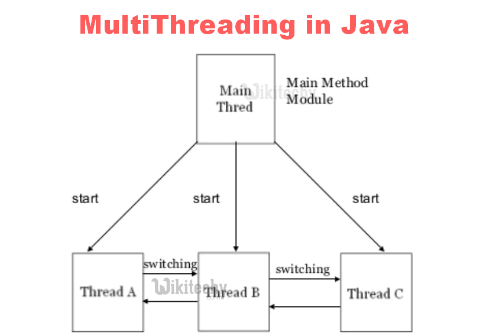
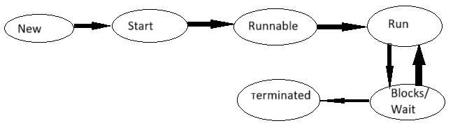

# ADVANCE JAVA
## ORM(Object Relation Mapping)
* To map Java object with database
* Database Table to java java object
* ```text
  ORM FRAMEWORK
  * Hibernate
  * JPA
  * Spring Data
  * MyBatis 
  ```
## Hibernate## Hibernate Setup (Using Maven)
1) Create a Maven Project
   Use your IDE (e.g., IntelliJ IDEA, Eclipse) to create a new Maven project.
2) Add Dependencies in `pom.xml`
```xml
<dependencies>
  <dependency>
    <groupId>org.hibernate.orm</groupId>
    <artifactId>hibernate-core</artifactId>
    <version>6.4.4.Final</version>
  </dependency>

  <dependency>
    <groupId>jakarta.persistence</groupId>
    <artifactId>jakarta.persistence-api</artifactId>
    <version>3.1.0</version>
  </dependency>

  <dependency>
    <groupId>mysql</groupId>
    <artifactId>mysql-connector-java</artifactId>
    <version>8.0.33</version>
  </dependency>
</dependencies>
```
3)Create hibernate.cfg.xml inside resource folder
4)create a table
5)create an entity class
6)create a main class to work ORM
##### 📚 Libraries need to Download
* Jakarta Persistence API
* MySQL Connector/J
* Hibernate Core
## Entity Class
```java
@ientity
class employee {
@Id
@GeneratedValue(strategy = GenerationType.IDENTITY)
@column(name = "id")
int id;
@column(name = "emp-name")
String Name;
// getters and setters
   }

```
## <u>Hibernate</u>
```java
class HibernateDemo {
    public static void main(String[] args) throws Exception {
        SessionFactory factory = new Configuration().configure("hibernate.cfg.xml").buildSessionFactory();
        Session session = factory.openSession();
        session.beginTransaction();
        Employee e = new Employee();
        e.setName("Ram");
        e.setSalary(10000);
        session.persist(e);
        session.getTransaction().commit();
        session.close();
        session = factory.openSession();
        Employee e1 = session.get(Employee.class, 1);
        System.out.println("Name :" + e1.getName());
        session.beginTransaction();
        e1.setSalary(30000);
        session.merge(e1);
        session.getTransaction().commit();
        session.close();
    }
}
```
---
## Web Framework
* Framework design to ease the development of Web Application<br><br>
  <u><b>JAVA Base Web Framework : </u></b>
* Spring Boot/ MVC
* JSF(Java Server Faces)
* Struts
  <br>
  <u><b>Feature :</b></u>
* Security
* Templating
* MVC Patten
* REST
* ORM
--- 


---
## Multi Threading

* Thread is process
* To multiple process parallely run at a same time
## To create thread :
i.By Inheriting form Thread
ii.By implementing Runnable interface
## Life Cycle of Thread :
## 🧵 Java Thread Life Cycle



| **State**        | **Description**                                                      | **Method/Trigger**                                           |
|------------------|----------------------------------------------------------------------|--------------------------------------------------------------|
| **1. New**       | Thread object is created, but not started.                           | `Thread t = new Thread();`                                   |
| **2. Start**     | Calls the `start()` method, moving thread to **Runnable** state.     | `t.start();`                                                 |
| **3. Runnable**  | Thread is ready to run; waiting for CPU.                             | Managed by Thread Scheduler                                  |
| **4. Run**       | When CPU picks the thread, `run()` is executed.                      | Override `run()` method                                      |
| **5. Blocked**   | Thread is blocked (e.g., waiting for a lock).                        | Occurs when accessing a locked synchronized block            |
| **6. Terminated** | Thread finishes execution or is stopped by error.                   |  Happens automatically at end of `run()` or due to exception |

```java
class ThreadDemo implements Runnable 
{
    Thread t;

    ThreadDemo() {
        t = new Thread(this);
        dt.start();
    }

    public void run() {
        for (int i = 0; i < 10; i++) {
            System.out.println("Hello" + i);
            try {
                t.sleep(100);
            } catch (Exception e) {}
        }
    }

    public static void main(String[] args) {
        ThreadDemo obj = new ThreadDemo();
        ThreadDemo obj1 = new ThreadDemo();
    } 
}
```
## Synchronization
* prevent from accusing same resources at a time
#### Type :
**Method Synchronization**
* Synchronizing the entire method to allow only one thread at a time.

**Block Synchronization**
* Synchronizing a specific block of code within a method.<br>
---
eg:
```java
class BankAccount
{
    int Balance =1000;
    public synchronized void withdraw(String n,int amt) {
        if (Balance >= amt) {
            System.out.println("Withdraw Success by :" + n);
            try { 
                Thread.sleep(1000); 
            } 
            catch (Exception e) { }
            Balance -= amt;
        } 
        else 
        { 
            System.out.println("Balance not Enough"); 
        }
    }
}
```
eg:
```java
class Bankwithdraw extends Thread
{
    BankAccount acc;
    String name;
    int amt;
    Bankwithdraw(BankAccount acc,int amat,String n)
    {
        this.acc =acc;
        this.name=n;
        this.amt = a;
    }
    public void run()
    {
        acc.withdraw(n,amt);
    }
    
}
```
eg:
```java
class caller
{
    public static void main(String[] args) {
        BankAccount ac = new BankAccount();
        Bankwithdraw obj = new Bankwithdraw(ac,600,"Ram");
        Bankwithdraw obj1 = new Bankwithdraw(ac,500,"Hari");
        obj.start();
        obj1.start();
    }
}
```
---

---