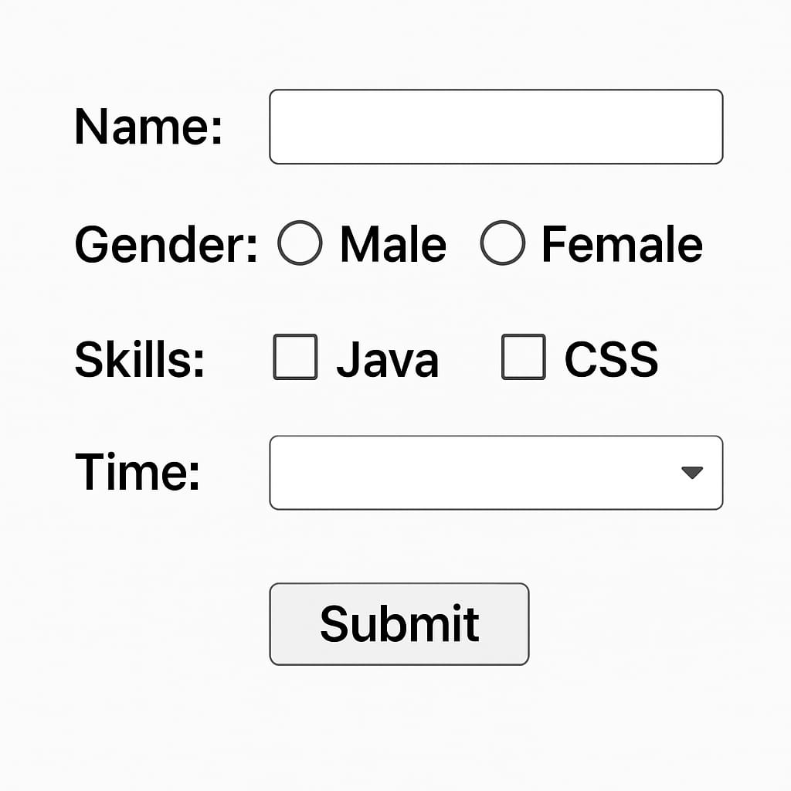

# 📘 Unit 6: Servlets and JSP (6 Hours)

---

## Overview of Web Application

A **Web Application** is a client-server application that runs in a browser and communicates over HTTP/HTTPS.

### Key Components:

* **Client**: Browser (Chrome, Firefox, etc.)
* **Web Server**: Apache Tomcat (handles requests)
* **Backend**: Servlet/JSP/Java code
* **Database**: MySQL, Oracle, etc.

### Web App Flow:

1. User sends request from browser
2. Server receives request (HTTP)
3. Servlet processes logic and interacts with DB
4. Response is sent back to client

---

## HTTP Methods and Responses

### 🔁 HTTP Methods:

| Method | Purpose       |
| ------ | ------------- |
| GET    | Retrieve data |
| POST   | Submit data   |
| PUT    | Update data   |
| DELETE | Delete data   |

### 📨 HTTP Responses:

* Status Codes:

    * `200 OK`: Successful
    * `404 Not Found`: Resource not found
    * `500 Internal Server Error`: Server crash
    * `302 Found`: Redirect

---

## Servlets
- A **Servlet** is a Java class that handles HTTP requests and generates responses.
- Java program to Accept Request process and generate the response.

### To create servlets
- Inherit from HttpServlet.
- Use doGet/doPost Methods
- Define URL using @webservlets("/Demo)- Annotation

**Example**

```java
import com.sun.net.httpserver.HttpServer;
import jakarta.servlet.https.*;

@webservlets("/demo");
public class MyServlets extends HttpServlet{
    public static void main(String [] args){
        printwriter.out = res.getwriter();
        out.println("Hello");
    }
}
```

### 🚦 Servlet Life Cycle:

1. **Loading**: Servlet class is loaded.
2. **Instantiation**: Object of servlet is created.
3. **Initialization**: `init()` method called once.
4. **Request Handling**: `service()` → `doGet()` / `doPost()` called multiple times.
5. **Destroying**: `destroy()` called before servlet is unloaded.

### 🔁 Servlet Methods:

```java
public void init() throws ServletException { }
public void service(ServletRequest req, ServletResponse res) { }
public void destroy() { }
```

---

**Example**

```java
import com.sun.net.httpserver.HttpServer;
import jakarta.servlet.*;

@WebServlet("/lifecycle")
public class LifeCycleServlets extends HttpServlet {
  public void init(ServletConfig config) throws Exception {
    System.out.println("Servlet Initialized");
  }

  public void Service(HttpServetRequest req, HttpServletResponse res)throws Exception{
      System.out.println("Service called...");
  }
}
```
## 6.4 Writing Servlet Programs with Servlet APIs

### ✅ Steps to Write a Servlet:

1. Extend `HttpServlet`
2. Override `doGet()` or `doPost()`
3. Map the servlet in `web.xml` or use `@WebServlet` annotation

### 📌 Example: Basic Servlet

```java
import java.io.*;
import javax.servlet.*;
import javax.servlet.http.*;

@WebServlet("/hello")
public class HelloServlet extends HttpServlet {
    public void doGet(HttpServletRequest req, HttpServletResponse res)
    throws ServletException, IOException {
        res.setContentType("text/html");
        PrintWriter out = res.getWriter();
        out.println("<h1>Hello from Servlet</h1>");
    }
}
```

---

## 6.5 Reading and Processing Forms

### 🧾 HTML Form:

```html
<form action="login" method="post">
  Username: <input type="text" name="username" />
  Password: <input type="password" name="password" />
  <input type="submit" value="Login" />
</form>
```

### 🔄 Servlet to Read Form:

```java
@WebServlet("/login")
public class LoginServlet extends HttpServlet {
    protected void doPost(HttpServletRequest req, HttpServletResponse res)
    throws ServletException, IOException {
        String user = req.getParameter("username");
        String pass = req.getParameter("password");
        
        PrintWriter out = res.getWriter();
        out.println("Username: " + user + "<br>Password: " + pass);
    }
}
```

---

## 6.6 Handling GET/POST Requests

### 📥 GET vs POST:

* **GET**: Parameters visible in URL, limited size, used for retrieval
* **POST**: Hidden parameters, larger data, used for form submission

### Example Servlet for Both:

```java
@WebServlet("/method")
public class MethodServlet extends HttpServlet {
    protected void doGet(HttpServletRequest req, HttpServletResponse res)
    throws ServletException, IOException {
        res.getWriter().println("GET method called");
    }

    protected void doPost(HttpServletRequest req, HttpServletResponse res)
    throws ServletException, IOException {
        res.getWriter().println("POST method called");
    }
}
```

---

## 6.7 Database Connectivity Through Servlets

### ✅ Required:

* MySQL connector JAR
* JDBC connection setup in Servlet

### 📌 Example: Login Validation with MySQL

#### 🧾 Database Table: `user`

| id | username | password |
| -- | -------- | -------- |
| 1  | admin    | 1234     |

#### Servlet Code:

```java
@WebServlet("/validate")
public class DBServlet extends HttpServlet {
    protected void doPost(HttpServletRequest req, HttpServletResponse res)
    throws ServletException, IOException {
        String uname = req.getParameter("username");
        String pass = req.getParameter("password");

        try {
            Class.forName("com.mysql.cj.jdbc.Driver");
            Connection con = DriverManager.getConnection(
                "jdbc:mysql://localhost:3306/mydb", "root", "root");

            PreparedStatement ps = con.prepareStatement(
                "SELECT * FROM user WHERE username=? AND password=?");

            ps.setString(1, uname);
            ps.setString(2, pass);

            ResultSet rs = ps.executeQuery();
            PrintWriter out = res.getWriter();
            res.setContentType("text/html");

            if (rs.next()) {
                out.println("<h2>Login Successful</h2>");
            } else {
                out.println("<h2>Login Failed</h2>");
            }

            rs.close(); ps.close(); con.close();
        } catch (Exception e) {
            e.printStackTrace();
        }
    }
}
```

---

## 🛠️ Tools You Need:

* **Apache Tomcat** (Web server)
* **MySQL** (Database)
* **Eclipse/IntelliJ** (IDE)
* **Servlet API** (Included in Tomcat lib folder)

---

Let me know if you want:

* PDF version of this note ✅
* JSP coverage for Unit 7 or continuation ✅
* Lab-based programs from this unit ✅
# 📘 Unit 6: Servlets and JSP (6 Hours)

---

## Overview of Web Application

A **Web Application** is a client-server application that runs in a browser and communicates over HTTP/HTTPS.

### Key Components:

* **Client**: Browser (Chrome, Firefox, etc.)
* **Web Server**: Apache Tomcat (handles requests)
* **Backend**: Servlet/JSP/Java code
* **Database**: MySQL, Oracle, etc.

### Web App Flow:

1. User sends request from browser
2. Server receives request (HTTP)
3. Servlet processes logic and interacts with DB
4. Response is sent back to client

---

## HTTP Methods and Responses

### 🔁 HTTP Methods:

| Method | Purpose       |
| ------ | ------------- |
| GET    | Retrieve data |
| POST   | Submit data   |
| PUT    | Update data   |
| DELETE | Delete data   |

### 📨 HTTP Responses:

* Status Codes:

    * `200 OK`: Successful
    * `404 Not Found`: Resource not found
    * `500 Internal Server Error`: Server crash
    * `302 Found`: Redirect

---

## Servlets
- A **Servlet** is a Java class that handles HTTP requests and generates responses.
- Java program to Accept Request process and generate the response.

### To create servlets
- Inherit from HttpServlet.
- Use doGet/doPost Methods
- Define URL using @webservlets("/Demo)- Annotation

**Example**

```java
import com.sun.net.httpserver.HttpServer;
import jakarta.servlet.https.*;

@webservlets("/demo");
public class MyServlets extends HttpServlet{
    public static void main(String [] args){
        printwriter.out = res.getwriter();
        out.println("Hello");
    }
}
```

### 🚦 Servlet Life Cycle:

1. **Loading**: Servlet class is loaded.
2. **Instantiation**: Object of servlet is created.
3. **Initialization**: `init()` method called once.
4. **Request Handling**: `service()` → `doGet()` / `doPost()` called multiple times.
5. **Destroying**: `destroy()` called before servlet is unloaded.

### 🔁 Servlet Methods:

```java
public void init() throws ServletException { }
public void service(ServletRequest req, ServletResponse res) { }
public void destroy() { }
```

---

**Example**

```java
import com.sun.net.httpserver.HttpServer;
import jakarta.servlet.*;

@WebServlet("/lifecycle")
public class LifeCycleServlets extends HttpServlet {
  public void init(ServletConfig config) throws Exception {
    System.out.println("Servlet Initialized");
  }

  public void Service(HttpServetRequest req, HttpServletResponse res)throws Exception{
      System.out.println("Service called...");
  }
}
```
## 6.4 Writing Servlet Programs with Servlet APIs

### ✅ Steps to Write a Servlet:

1. Extend `HttpServlet`
2. Override `doGet()` or `doPost()`
3. Map the servlet in `web.xml` or use `@WebServlet` annotation

### 📌 Example: Basic Servlet

```java
import java.io.*;
import javax.servlet.*;
import javax.servlet.http.*;

@WebServlet("/hello")
public class HelloServlet extends HttpServlet {
    public void doGet(HttpServletRequest req, HttpServletResponse res)
    throws ServletException, IOException {
        res.setContentType("text/html");
        PrintWriter out = res.getWriter();
        out.println("<h1>Hello from Servlet</h1>");
    }
}
```

---

## 6.5 Reading and Processing Forms

### 🧾 HTML Form:

```html
<form action="login" method="post">
  Username: <input type="text" name="username" />
  Password: <input type="password" name="password" />
  <input type="submit" value="Login" />
</form>
```

### 🔄 Servlet to Read Form:

```java
@WebServlet("/login")
public class LoginServlet extends HttpServlet {
    protected void doPost(HttpServletRequest req, HttpServletResponse res)
    throws ServletException, IOException {
        String user = req.getParameter("username");
        String pass = req.getParameter("password");
        
        PrintWriter out = res.getWriter();
        out.println("Username: " + user + "<br>Password: " + pass);
    }
}
```

---

## 6.6 Handling GET/POST Requests

### 📥 GET vs POST:

* **GET**: Parameters visible in URL, limited size, used for retrieval
* **POST**: Hidden parameters, larger data, used for form submission

### Example Servlet for Both:

```java
@WebServlet("/method")
public class MethodServlet extends HttpServlet {
    protected void doGet(HttpServletRequest req, HttpServletResponse res)
    throws ServletException, IOException {
        res.getWriter().println("GET method called");
    }

    protected void doPost(HttpServletRequest req, HttpServletResponse res)
    throws ServletException, IOException {
        res.getWriter().println("POST method called");
    }
}
```

---

## 6.7 Database Connectivity Through Servlets

### ✅ Required:

* MySQL connector JAR
* JDBC connection setup in Servlet

### 📌 Example: Login Validation with MySQL

#### 🧾 Database Table: `user`

| id | username | password |
| -- | -------- | -------- |
| 1  | admin    | 1234     |

#### Servlet Code:

```java
@WebServlet("/validate")
public class DBServlet extends HttpServlet {
    protected void doPost(HttpServletRequest req, HttpServletResponse res)
    throws ServletException, IOException {
        String uname = req.getParameter("username");
        String pass = req.getParameter("password");

        try {
            Class.forName("com.mysql.cj.jdbc.Driver");
            Connection con = DriverManager.getConnection(
                "jdbc:mysql://localhost:3306/mydb", "root", "root");

            PreparedStatement ps = con.prepareStatement(
                "SELECT * FROM user WHERE username=? AND password=?");

            ps.setString(1, uname);
            ps.setString(2, pass);

            ResultSet rs = ps.executeQuery();
            PrintWriter out = res.getWriter();
            res.setContentType("text/html");

            if (rs.next()) {
                out.println("<h2>Login Successful</h2>");
            } else {
                out.println("<h2>Login Failed</h2>");
            }

            rs.close(); ps.close(); con.close();
        } catch (Exception e) {
            e.printStackTrace();
        }
    }
}
```

---

## 🛠️ Tools You Need:

* **Apache Tomcat** (Web server)
* **MySQL** (Database)
* **Eclipse/IntelliJ** (IDE)
* **Servlet API** (Included in Tomcat lib folder)

---

Let me know if you want:

* PDF version of this note ✅
* JSP coverage for Unit 7 or continuation ✅
* Lab-based programs from this unit ✅
# 📘 Unit 6: Servlets and JSP (6 Hours)

---

## Overview of Web Application

A **Web Application** is a client-server application that runs in a browser and communicates over HTTP/HTTPS.

### Key Components:

* **Client**: Browser (Chrome, Firefox, etc.)
* **Web Server**: Apache Tomcat (handles requests)
* **Backend**: Servlet/JSP/Java code
* **Database**: MySQL, Oracle, etc.

### Web App Flow:

1. User sends request from browser
2. Server receives request (HTTP)
3. Servlet processes logic and interacts with DB
4. Response is sent back to client

---

## HTTP Methods and Responses

### 🔁 HTTP Methods:

| Method | Purpose       |
| ------ | ------------- |
| GET    | Retrieve data |
| POST   | Submit data   |
| PUT    | Update data   |
| DELETE | Delete data   |

### 📨 HTTP Responses:

* Status Codes:

    * `200 OK`: Successful
    * `404 Not Found`: Resource not found
    * `500 Internal Server Error`: Server crash
    * `302 Found`: Redirect

---

## Servlets
- A **Servlet** is a Java class that handles HTTP requests and generates responses.
- Java program to Accept Request process and generate the response.

### To create servlets
- Inherit from HttpServlet.
- Use doGet/doPost Methods
- Define URL using @webservlets("/Demo)- Annotation

**Example**

```java
import com.sun.net.httpserver.HttpServer;
import jakarta.servlet.https.*;

@webservlets("/demo");
public class MyServlets extends HttpServlet{
    public static void main(String [] args){
        printwriter.out = res.getwriter();
        out.println("Hello");
    }
}
```

### 🚦 Servlet Life Cycle:

1. **Loading**: Servlet class is loaded.
2. **Instantiation**: Object of servlet is created.
3. **Initialization**: `init()` method called once.
4. **Request Handling**: `service()` → `doGet()` / `doPost()` called multiple times.
5. **Destroying**: `destroy()` called before servlet is unloaded.

### 🔁 Servlet Methods:

```java
public void init() throws ServletException { }
public void service(ServletRequest req, ServletResponse res) { }
public void destroy() { }
```

---

**Example**

```java
import com.sun.net.httpserver.HttpServer;
import jakarta.servlet.*;

@WebServlet("/lifecycle")
public class LifeCycleServlets extends HttpServlet {
  public void init(ServletConfig config) throws Exception {
    System.out.println("Servlet Initialized");
  }

  public void Service(HttpServetRequest req, HttpServletResponse res)throws Exception{
      System.out.println("Service called...");
  }
}
```
## 6.4 Writing Servlet Programs with Servlet APIs

### ✅ Steps to Write a Servlet:

1. Extend `HttpServlet`
2. Override `doGet()` or `doPost()`
3. Map the servlet in `web.xml` or use `@WebServlet` annotation

### 📌 Example: Basic Servlet

```java
import java.io.*;
import javax.servlet.*;
import javax.servlet.http.*;

@WebServlet("/hello")
public class HelloServlet extends HttpServlet {
    public void doGet(HttpServletRequest req, HttpServletResponse res)
    throws ServletException, IOException {
        res.setContentType("text/html");
        PrintWriter out = res.getWriter();
        out.println("<h1>Hello from Servlet</h1>");
    }
}
```

---

## 6.5 Reading and Processing Forms

### 🧾 HTML Form:

```html
<form action="login" method="post">
  Username: <input type="text" name="username" />
  Password: <input type="password" name="password" />
  <input type="submit" value="Login" />
</form>
```

### 🔄 Servlet to Read Form:

```java
@WebServlet("/login")
public class LoginServlet extends HttpServlet {
    protected void doPost(HttpServletRequest req, HttpServletResponse res)
    throws ServletException, IOException {
        String user = req.getParameter("username");
        String pass = req.getParameter("password");
        
        PrintWriter out = res.getWriter();
        out.println("Username: " + user + "<br>Password: " + pass);
    }
}
```

---

## 6.6 Handling GET/POST Requests

### 📥 GET vs POST:

* **GET**: Parameters visible in URL, limited size, used for retrieval
* **POST**: Hidden parameters, larger data, used for form submission

### Example Servlet for Both:

```java
@WebServlet("/method")
public class MethodServlet extends HttpServlet {
    protected void doGet(HttpServletRequest req, HttpServletResponse res)
    throws ServletException, IOException {
        res.getWriter().println("GET method called");
    }

    protected void doPost(HttpServletRequest req, HttpServletResponse res)
    throws ServletException, IOException {
        res.getWriter().println("POST method called");
    }
}
```

---

## 6.7 Database Connectivity Through Servlets

### ✅ Required:

* MySQL connector JAR
* JDBC connection setup in Servlet

### 📌 Example: Login Validation with MySQL

#### 🧾 Database Table: `user`

| id | username | password |
| -- | -------- | -------- |
| 1  | admin    | 1234     |

#### Servlet Code:

```java
@WebServlet("/validate")
public class DBServlet extends HttpServlet {
    protected void doPost(HttpServletRequest req, HttpServletResponse res)
    throws ServletException, IOException {
        String uname = req.getParameter("username");
        String pass = req.getParameter("password");

        try {
            Class.forName("com.mysql.cj.jdbc.Driver");
            Connection con = DriverManager.getConnection(
                "jdbc:mysql://localhost:3306/mydb", "root", "root");

            PreparedStatement ps = con.prepareStatement(
                "SELECT * FROM user WHERE username=? AND password=?");

            ps.setString(1, uname);
            ps.setString(2, pass);

            ResultSet rs = ps.executeQuery();
            PrintWriter out = res.getWriter();
            res.setContentType("text/html");

            if (rs.next()) {
                out.println("<h2>Login Successful</h2>");
            } else {
                out.println("<h2>Login Failed</h2>");
            }

            rs.close(); ps.close(); con.close();
        } catch (Exception e) {
            e.printStackTrace();
        }
    }
}
```

---

## 🛠️ Tools You Need:

* **Apache Tomcat** (Web server)
* **MySQL** (Database)
* **Eclipse/IntelliJ** (IDE)
* **Servlet API** (Included in Tomcat lib folder)

---

Let me know if you want:
* PDF version of this note ✅
* JSP coverage for Unit 7 or continuation ✅
* Lab-based programs from this unit ✅
---
webApp/
├── form.html
├── WEB-INF/
│   ├── web.xml (if not using annotation)
│   ├── classes/
│   │   └── com/example/FormServlet.class


```java
//java class folder 
package com.example;

import jakarta.servlet.ServletException;
import jakarta.servlet.annotation.WebServlet;
import jakarta.servlet.http.*;

import java.io.IOException;
import java.io.PrintWriter;

@WebServlet("/formServlet")  // URL pattern
public class FormServlet extends HttpServlet {

  protected void doPost(HttpServletRequest req, HttpServletResponse res) throws Exception {
    res.setContentType("text/html");
    PrintWriter out = res.getWriter();

    // Get parameters from form
    String name = req.getParameter("name");
    String email = req.getParameter("email");

    // Display the result
    out.println("<html><body>");
    out.println("<h2>Form Submitted Successfully!</h2>");
    out.println("<p><strong>Name:</strong> " + name + "</p>");
    out.println("<p><strong>Email:</strong> " + email + "</p>");
    out.println("</body></html>");
  }
}


```

```html
<!--write java code first before writing this-->
<html>
<body>
<!-- 
post = if you wrote doPost in servlet (used for form submission)
get  = if you wrote doGet in servlet (used for link or display-only request)
-->
<form method="post" action="formServlet">
  Name: <input type="text" name="name"><br>
  Email: <input type="text" name="email"><br>
  <input type="submit" value="OK">
</form>
</body>
</html>
```
| Part                          | Description                                                     |
|-------------------------------|-----------------------------------------------------------------|
| `@WebServlet("/formServlet")` | Tells Tomcat to run this servlet when the URL is `/formServlet` |
| `doPost()`                    | Handles form submissions using POST method                      |
| `req.getParameter("name")`    | Reads the input field with `name="name"`                        |
---
## JSP(JAVA Server Pages):
* JAVA Based Server Side Scripts Language (HTML+JAVA)
* Its Servlets Wrapper

# JSP Tags

| Tag Syntax                             | Purpose                                                                 | Example                                            |
|----------------------------------------|-------------------------------------------------------------------------|----------------------------------------------------|
| `<% ... %>`                            | Scriptlet: Embed Java code inside JSP                                   | `<% int x = 5; %>`                                 |
| `<%= ... %>`                           | Expression: Output Java expression result to page                       | `<%= new java.util.Date() %>`                      |
| `<%! ... %>`                           | Declaration: Declare Java variables/methods                             | `<%! int counter = 0; %>`                          |
| `<%@ page ... %>`                      | Directive: Page-level instructions (import, content type, etc.)         | `<%@ page language="java" import="java.util.*" %>` |
| `<%@ include file="..." %>`            | Include directive: includes a file at translation time (static include) | `<%@ include file="header.jsp" %>`                 |
| `<jsp:include page="..." />`           | Action tag: includes a file at request time (dynamic include)           | `<jsp:include page="footer.jsp" />`                |
| `<jsp:param name="..." value="..." />` | Pass parameters to included pages                                       | Used inside `<jsp:include>`                        |

---

## Example JSP snippet using tags:

```html
<%@ page language="java" contentType="text/html; charset=UTF-8" %>
<html>
<body>

<%
    // Scriptlet: Java code
    String username = request.getParameter("username");
%>

<h2>Welcome, <%= username != null ? username : "Guest" %>!</h2>

</body>
</html>
```

## JSP Implicit Objects
-->Set of pre-define Object
These are built-in objects you can use directly in any JSP file.

| Object          | Type                   | Description                                                                  | Scope        |
|-----------------|------------------------|------------------------------------------------------------------------------|--------------|
| `out`           | `JspWriter`            | Sends output (HTML/text) to the client                                       | for output   |
| `request`       | `HttpServletRequest`   | Represents the client's HTTP request                                         | Request      |
| `session`       | `HttpSession`          | Stores user data between multiple requests                                   | Session      |
| **`exception`** | `Throwable`            | Holds the exception object (only available in error pages)                   | Page (Error) |
| `application`   | `ServletContext`       | Stores global data shared across the application                             | Application  |
| `config`        | `ServletConfig`        | Contains configuration info from web.xml                                     | Application  |
| `page`          | `Object`               | Refers to the current JSP page instance (similar to `this` in Java)          | Page         |
| `pageContext`   | `PageContext`          | Provides access to all JSP implicit objects and scoped variables             | Page         |

---
)

```tree
YourProject/
├── src/
│   └── your/package/name/
│       └── FormHandler.java
├── WebContent/ or webapp/
│   └── form.html
│   └── WEB-INF/
│       └── web.xml (optional if using annotation)
```


```html
<!--form-->
<html>
<head>
  <title>Simple Form</title>
</head>
<body>
<form method="post" action="input.jsp">
  <!-- Name field -->
  Name: <input type="text" name="name"><br><br>

  <!-- Gender radio buttons -->
  Gender:
  <input type="radio" name="gender" value="F"> Female
  <input type="radio" name="gender" value="M"> Male<br><br>

  <!-- Course checkbox -->
  Course:
  <input type="checkbox" name="course" value="C++"> C++<br><br>

  <!-- Time dropdown -->
  Time:
  <select name="time">
    <option value="morning">Morning</option>
    <option value="afternoon">Afternoon</option>
    <option value="evening">Evening</option>
  </select><br><br>

  <!-- Submit button -->
  <input type="submit" value="Submit">
</form>
</body>
</html>
```
```java
import java.io.IOException;
import java.io.PrintWriter;
import javax.servlet.ServletException;
import javax.servlet.annotation.WebServlet;
import javax.servlet.http.*;

@WebServlet("/FormHandler")
public class FormHandler extends HttpServlet {
    protected void doPost(HttpServletRequest request, HttpServletResponse response)
            throws ServletException, IOException {

        response.setContentType("text/html;charset=UTF-8");
        PrintWriter out = response.getWriter();

        String name = request.getParameter("name");
        String gender = request.getParameter("gender");
        String time = request.getParameter("time");
        String[] courses = request.getParameterValues("course");

        out.println("<html><body>");
        out.println("<h1>Your Information</h1>");
        out.println("Name: " + name + "<br>");
        out.println("Gender: " + gender + "<br>");
        out.println("Time: " + time + "<br>");

        out.println("<h3>Courses:</h3>");
        if (courses != null) {
            out.println("<ul>");
            for (String c : courses) {
                out.println("<li>" + c + "</li>");
            }
            out.println("</ul>");
        } else {
            out.println("No course selected.");
        }

        out.println("<br><a href='form.html'>Go Back</a>");
        out.println("</body></html>");
    }
}
```
## input jsp
```html
<%
// Retrieve form parameters
String name = request.getParameter("name");
String gender = request.getParameter("gender");
String time = request.getParameter("time");
String course[] = request.getParameterValues("course"); // Corrected: parameter name & method
%>

<h1>Your Information</h1>
Name: <%= name %> <br>
Gender: <%= gender %> <br>
Time: <%= time %> <br>

<% if (course != null) { %>
<ul>
  <% for(String c : course) { %>
  <li><%= c %></li>
  <% } %>
</ul>
<% } else { %>
No course selected.
<% } %>
```
---

---
## Session

```html
<!--login-->

<html>
<head>
  <title>Login Page</title>
</head>
<body>
<h2>Login</h2>
<form method="post" action="logincheck.jsp">
  Username: <input type="text" name="user"><br><br>
  Password: <input type="password" name="pass"><br><br>
  <input type="submit" value="Login">
</form>
</body>
</html>


```html
<%
<%@ page language="java" %>
String name = request.getParameter("user");
String pwd = request.getParameter("pass");

if (name.equals("cosmos") && pwd.equals("cosmos")) {
session.setAttribute("NAME", name);
%>
<h2>Login successful!</h2>
<p>Welcome, <%= name %></p>
<%
} else {
%>
<h2>Login failed!</h2>
<p>Invalid username or password.</p>
<%
}
%>
<%String name =(String)session.getAttribute("NAME")
%> 
<h1>Hello,<%=name%> </h1>
```
---
---
## Cookie
* To store small  information on a client machine
* To tack user

```java 
//        Name<------------|       |--------->value
Cookie cook = new Cookie(String,String);
getValue();
getName();
setMaxAge(long);
//to add cookie:
  response.addcookie(cook);
```
---
```
* cook.html
```html
<html>
<body>
<form method="get" action="setCookie.jsp">
  Name: <input type="text" name="name"><br>
  <input type="submit" value="Submit">
</form>
</body>
</html>

```
* setCookie.jsp
```html
<%
String name = request.getParameter("name");
Cookie cook = new Cookie("NAME", name);
response.addCookie(cook);
out.println("Cookie added successfully.");
%>
<br>
<a href="getCookie.jsp">Get Cookie</a>

```
* getcookie.jsp
```html
<%
Cookie cooks[] = request.getCookies();
if (cooks != null) {
for (Cookie c : cooks) {
if (c.getName().equals("NAME")) {
String v =c.getValue();
out.println("Cookie Value: " + v);
break;
}
}
} else {
out.println("No cookies found.");
}
%>
```
---


---